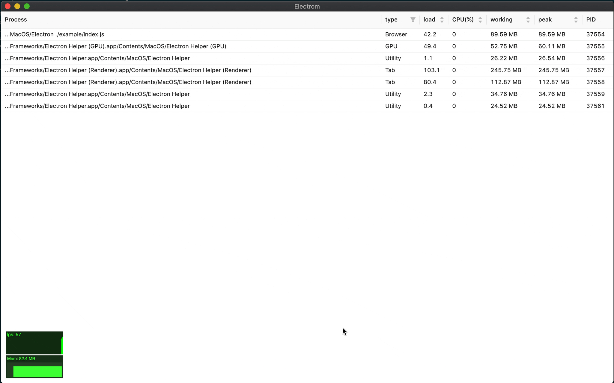

# electrom

[![NPM version][npm-image]][npm-url]
[![CI][CI-image]][CI-url]
[![Test coverage][codecov-image]][codecov-url]
[![node version][node-image]][node-url]
[![npm download][download-image]][download-url]

[npm-image]: https://img.shields.io/npm/v/electrom.svg
[npm-url]: https://npmjs.org/package/electrom
[CI-image]: https://github.com/electron-modules/electrom/actions/workflows/ci.yml/badge.svg
[CI-url]: https://github.com/electron-modules/electrom/actions/workflows/ci.yml
[codecov-image]: https://img.shields.io/codecov/c/github/electron-modules/electrom.svg?logo=codecov
[codecov-url]: https://codecov.io/gh/electron-modules/electrom
[node-image]: https://img.shields.io/badge/node.js-%3E=_8-green.svg
[node-url]: http://nodejs.org/download/
[download-image]: https://img.shields.io/npm/dm/electrom.svg
[download-url]: https://npmjs.org/package/electrom

> Electrom is a resource management solution for Electron applications, which is convenient for performance management and friendly debugging of multiple windows.



<!-- GITCONTRIBUTOR_START -->

## Contributors

|[<br/><sub><b>xudafeng</b></sub>](https://github.com/xudafeng)<br/>|[<br/><sub><b>yantze</b></sub>](https://github.com/yantze)<br/>|[<br/><sub><b>sriting</b></sub>](https://github.com/sriting)<br/>|[<br/><sub><b>snapre</b></sub>](https://github.com/snapre)<br/>|
| :---: | :---: | :---: | :---: |


This project follows the git-contributor [spec](https://github.com/xudafeng/git-contributor), auto updated at `Tue May 03 2022 11:32:04 GMT+0800`.

<!-- GITCONTRIBUTOR_END -->

## Installment

```shell
npm i electrom --save-dev
```

## How to use

Please visit the demo code: [./example/main.ts](./example/main.ts)

```typescript
// main process: import electrom
import {
  EVENT_DATA_CHANNEL_NAME,
  BROWSER_WINDOW_PRELOAD_PATH,
  Monitor,
} from 'electrom';

const monitor = new Monitor();
/**
 * Please set this script's path as `webPreferences.preload` of `BrowserWindow`.
 * {
 *   preload: BROWSER_WINDOW_PRELOAD_PATH
 * }
 */
mainWindow.webContents.on('dom-ready', () => {
  monitor.on(EVENT_DATA_CHANNEL_NAME, (data: any) => {
    mainWindow.webContents.send(EVENT_DATA_CHANNEL_NAME, data);
  });
  monitor.bindEventToWindow(mainWindow);
  monitor.start();
});
```

## Perf Board

You can use the Perf-Board standalone in your front-end.

```javascript
import React from 'react';
import PerfBoard from 'electrom/src/PerfBoard';

function() {
  return (
    <PerfBoard />
  );
}
```

## TODO

- [ ] heapdump

## License

The MIT License (MIT)
