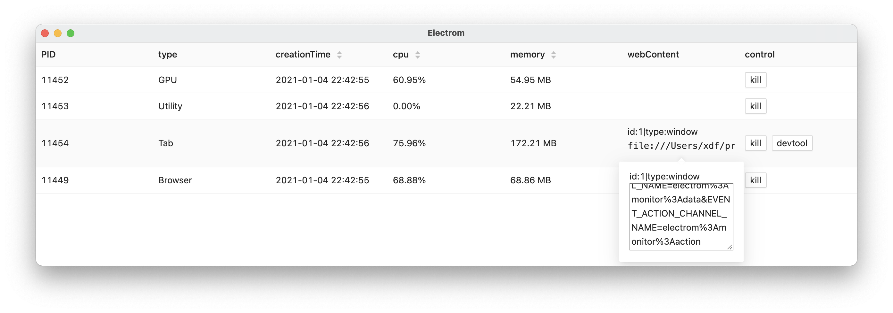

# electrom

[![NPM version][npm-image]][npm-url]
[![build status][travis-image]][travis-url]
[![Test coverage][coveralls-image]][coveralls-url]
[![node version][node-image]][node-url]
[![npm download][download-image]][download-url]

[npm-image]: https://img.shields.io/npm/v/electrom.svg
[npm-url]: https://npmjs.org/package/electrom
[travis-image]: https://api.travis-ci.com/electron-modules/electrom.svg?branch=master
[travis-url]: https://travis-ci.com/github/electron-modules/electrom
[coveralls-image]: https://img.shields.io/coveralls/electron-modules/electrom.svg
[coveralls-url]: https://coveralls.io/r/electron-modules/electrom?branch=master
[node-image]: https://img.shields.io/badge/node.js-%3E=_8-green.svg
[node-url]: http://nodejs.org/download/
[download-image]: https://img.shields.io/npm/dm/electrom.svg
[download-url]: https://npmjs.org/package/electrom

> Electrom is a resource management solution for Electron applications, which is convenient for performance management and friendly debugging of multiple windows.



## Installment

```bash
$ npm i electrom --save-dev
```

## CLI Usage

```bash
$ npx electrom 100
```

## APIs

```javascript
const electrom = require('electrom');

electrom(100)
  .then(data => {
    console.log(data);
  })
  .catch(e) {
    console.log(e);
  }
```

## Status Board

```javascript
import React from 'react';
import StatusBoard from 'electrom/src/StatusBoard';
import { ipcRenderer, shell } from 'electron';

function() {
  return (
    <StatusBoard
      eventDataChannelName="electrom:monitor:data"
      eventActionChannelName="electrom:monitor:action"
      ipcRenderer={ipcRenderer}
      shell={shell}
    />
  );
}
```

## Perf Board

```javascript
import React from 'react';
import PerfBoard from 'electrom/src/PerfBoard';

function() {
  return (
    <PerfBoard />
  );
}
```

## TODO

- [ ] heapdump

<!-- GITCONTRIBUTOR_START -->

## Contributors

|[<br/><sub><b>electron-modules</b></sub>](https://github.com/electron-modules)<br/>|[<br/><sub><b>yantze</b></sub>](https://github.com/yantze)<br/>|
| :---: | :---: |


This project follows the git-contributor [spec](https://github.com/electron-modules/git-contributor), auto updated at `Wed Jul 28 2021 14:13:28 GMT+0800`.

<!-- GITCONTRIBUTOR_END -->

## License

The MIT License (MIT)
